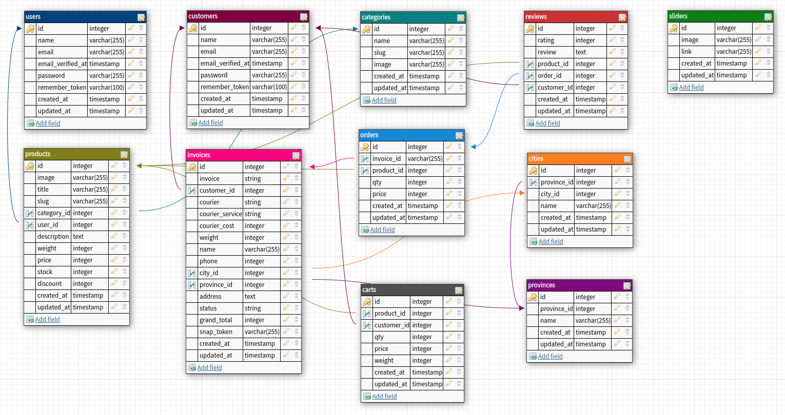

# Mi Store - Portofolio Backend REST API

This is the Mi Store website, an e-commerce platform for buying and selling electronic goods for Xiaomi's distributor store. It offers a wide range of Xiaomi products that can be delivered all over Indonesia and supports online payment methods.

## Tech Stack

### Frameworks & Libraries

- **Laravel**: A robust PHP framework designed for building web applications with an elegant syntax and various built-in tools and features for routing, authentication, and database management.
- **Cloudinary Laravel:** A Laravel package that provides integration with Cloudinary, a cloud service that offers image and video upload, storage, manipulation, and delivery.
- **Guzzle**: A PHP HTTP client that makes it easy to send HTTP requests and integrate with web services. It provides a simple interface for building and sending HTTP requests.
- **Laravel Sanctum**: A simple package that provides a featherweight authentication system for SPAs (single page applications), mobile applications, and simple token-based APIs.
- **Laravel Tinker**: An interactive command-line tool for Laravel, powered by PsySH, allowing you to interact with your entire Laravel application, including the Eloquent ORM and jobs.
- **Midtrans PHP**: A PHP library for integrating Midtrans, an online payment gateway that allows merchants to accept various payment methods securely.
- **Predis**: A flexible and feature-complete Redis client library for PHP, allowing you to interact with Redis databases with ease.
- **JWT Auth**: A PHP library that provides a simple way to authenticate users using JSON Web Tokens (JWT) in a Laravel application.
- **Faker**: A PHP library that generates fake data for you, useful for populating databases with realistic data during development and testing.
- **Pint**: A PHP code style fixer for Laravel, ensuring your code adheres to the style standards defined in your project.
- **Sail**: A command-line interface for interacting with Laravel’s Docker development environment, making it easy to manage your Docker containers and services.
- **Mockery**: A PHP mocking library used for creating mock objects in unit tests, allowing you to test your code in isolation.
- **Collision**: A detailed error handler for the command-line interface (CLI) in Laravel applications, providing a better debugging experience with rich error messages and stack traces.

## Design REST API
### Database

### Postman Collection

## About Laravel

Laravel is a web application framework with expressive, elegant syntax. We believe development must be an enjoyable and creative experience to be truly fulfilling. Laravel takes the pain out of development by easing common tasks used in many web projects, such as:

- [Simple, fast routing engine](https://laravel.com/docs/routing).
- [Powerful dependency injection container](https://laravel.com/docs/container).
- Multiple back-ends for [session](https://laravel.com/docs/session) and [cache](https://laravel.com/docs/cache) storage.
- Expressive, intuitive [database ORM](https://laravel.com/docs/eloquent).
- Database agnostic [schema migrations](https://laravel.com/docs/migrations).
- [Robust background job processing](https://laravel.com/docs/queues).
- [Real-time event broadcasting](https://laravel.com/docs/broadcasting).

Laravel is accessible, powerful, and provides tools required for large, robust applications.

## Learning Laravel

Laravel has the most extensive and thorough [documentation](https://laravel.com/docs) and video tutorial library of all modern web application frameworks, making it a breeze to get started with the framework.

You may also try the [Laravel Bootcamp](https://bootcamp.laravel.com), where you will be guided through building a modern Laravel application from scratch.

If you don't feel like reading, [Laracasts](https://laracasts.com) can help. Laracasts contains thousands of video tutorials on a range of topics including Laravel, modern PHP, unit testing, and JavaScript. Boost your skills by digging into our comprehensive video library.

## Laravel Sponsors

We would like to extend our thanks to the following sponsors for funding Laravel development. If you are interested in becoming a sponsor, please visit the [Laravel Partners program](https://partners.laravel.com).

### Premium Partners

- **[Vehikl](https://vehikl.com/)**
- **[Tighten Co.](https://tighten.co)**
- **[WebReinvent](https://webreinvent.com/)**
- **[Kirschbaum Development Group](https://kirschbaumdevelopment.com)**
- **[64 Robots](https://64robots.com)**
- **[Curotec](https://www.curotec.com/services/technologies/laravel/)**
- **[Cyber-Duck](https://cyber-duck.co.uk)**
- **[DevSquad](https://devsquad.com/hire-laravel-developers)**
- **[Jump24](https://jump24.co.uk)**
- **[Redberry](https://redberry.international/laravel/)**
- **[Active Logic](https://activelogic.com)**
- **[byte5](https://byte5.de)**
- **[OP.GG](https://op.gg)**

## Contributing

Thank you for considering contributing to the Laravel framework! The contribution guide can be found in the [Laravel documentation](https://laravel.com/docs/contributions).

## Code of Conduct

In order to ensure that the Laravel community is welcoming to all, please review and abide by the [Code of Conduct](https://laravel.com/docs/contributions#code-of-conduct).

## Security Vulnerabilities

If you discover a security vulnerability within Laravel, please send an e-mail to Taylor Otwell via [taylor@laravel.com](mailto:taylor@laravel.com). All security vulnerabilities will be promptly addressed.

## License

The Laravel framework is open-sourced software licensed under the [MIT license](https://opensource.org/licenses/MIT).
